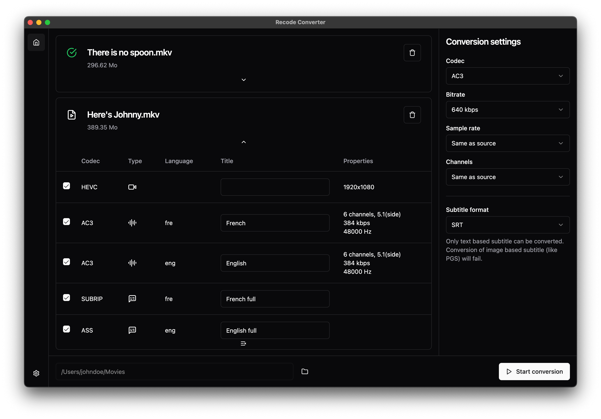

<div align="center">

<h1>Recode Converter</h1>
<strong>A simple, modern audio codec converter for video files</strong>
<br />
<br />

[](https://github.com/murgatt/recode-converter/releases/latest)
[](https://github.com/murgatt/recode-converter/releases)
[](https://github.com/murgatt/recode-converter/actions/workflows/main.yml)


</div>

## Download

**You can download the app on the website:**

[**recode-converter.app**](https://www.recode-converter.app/)

## Features

- Convert audio codecs
- Convert subtitle
- Convert multiple files at the same time
- Conversion settings
- View, edit & remove streams
- Light & dark themes
- Conversion notification
- Application settings
- Display spawned FFmpeg command

## Development

The application is built with Electron and React and is using FFmpeg.

### Requirements

Make sure to have [Node.js](https://nodejs.org/en) 18 or later & [pnpm](https://pnpm.io/fr/) 8.x installed.

### Installation

#### Clone this repository

```
git clone https://github.com/murgatt/recode-converter.git
```

#### Install dependencies

```
pnpm i
```

### Run the app

```
pnpm dev
```

### Building the app

```
pnpm build
```

This will build the app for your current platform. If you need to build it for another platform, you will need to install a specific version of [FFmpeg](https://github.com/kribblo/node-ffmpeg-installer?tab=readme-ov-file#compiling-ffmpeg-for-platforms-other-than-your-own) & [FFprobe](https://github.com/SavageCore/node-ffprobe-installer) and specify the target platform (`mac`, `linux`, `win`):

```
pnpm build --linux
```

### Other scripts

#### Tests

```
pnpm test
```

#### Lint

```
pnpm lint
```

and

```
pnpm lint:fix
```

#### Prettier

```
pnpm prettier
```

and

```
pnpm prettier:fix
```

#### Check types

```
pnpm types
```

## Contributing

Pull requests are welcome. For major changes, please open an issue first to discuss what you would like to change.

Please make sure to follow the code style of the project, add some tests and update translations if needed.

You found a bug, have a suggestion or want new codecs to be supported? Feel free to open an issue.

## License

[GPL-3.0 license](https://github.com/murgatt/recode-converter/blob/master/LICENSE)
